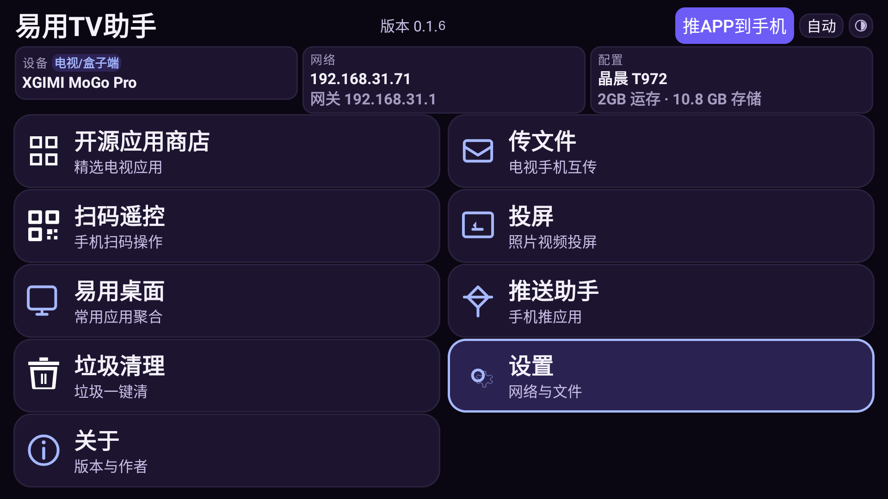
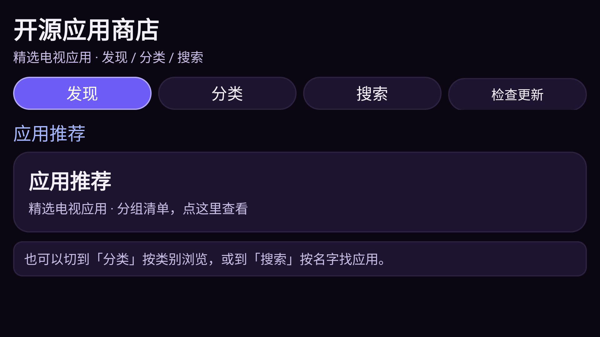
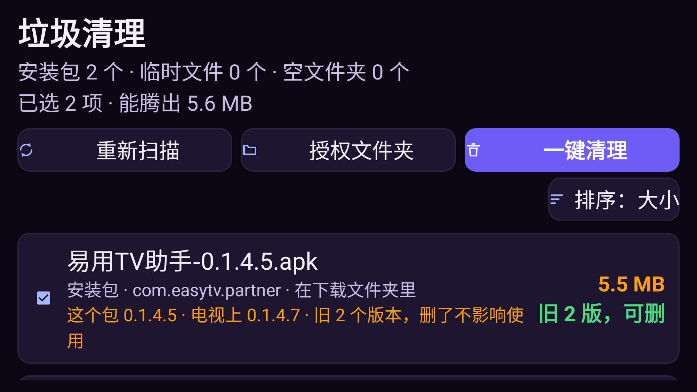
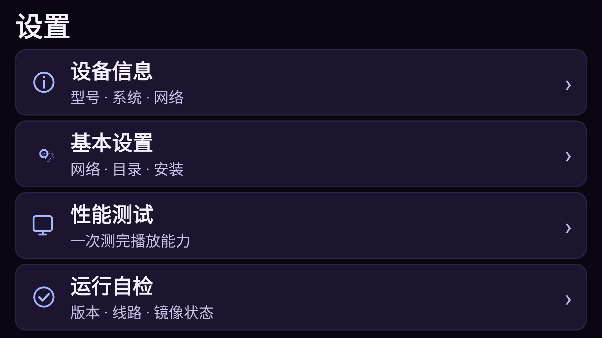
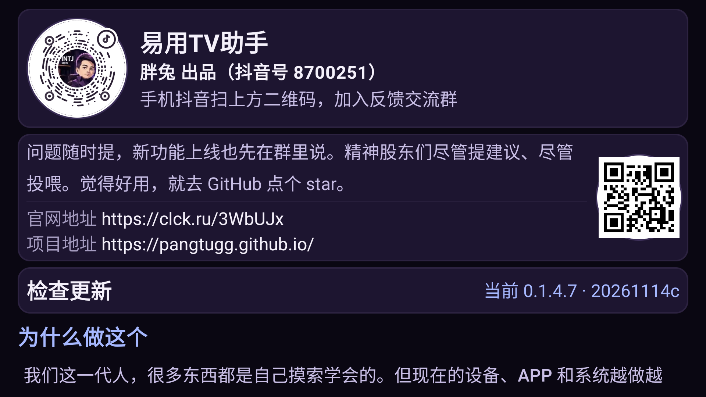

# 易用TV助手

  

> MBTI 说我是个紫人，那我手搓 AI 做的东西应该还靠谱，规矩也还立得住，这个小玩意儿你们应该用起来不烧心~~如果烧心了，跟我说~~

> ⚠️ **本项目与本页收录的所有软件，均仅供学习研究，不做商用。**

## 为什么做

我们这一代人，很多东西都是自己摸索学会的。可现在的电视和盒子越做越花，看个电视先过会员验证，再挨一轮广告，遥控器上几十个按钮，老人根本找不到北。

家里老人常卡在这几件事上：字太小、按钮藏得深；手机里的照片想放到电视上看，得先学一遍投屏；传个文件只能插 U 盘；给电视装个应用，电视连浏览器都没有，还得把网址抄到手机上再传过去。这些事在别的软件里都是分开做的，有的还得先注册账号。

我就想把这些事摆在一页上，字放大，遥控器按一按就能用。不注册、不弹广告、不偷偷上传，不联网的功能照样能用。说到底就是让不擅长折腾电子产品的人，自己也能把电视用明白——这是我做它唯一的目的。

顺带也想证明一件事：普通人用 AI，也能手搓出自己真正想要的东西。

## 干什么

九个模块一页看完：开源应用商店、传文件、扫码遥控、投屏、极简桌面、推送助手、垃圾清理、设置、关于。

**电视盒子专属开源应用商店**：集合 83 款优质电视应用、9 大分类，电视或盒子上直接挑、直接装；下载镜像优先，国内快。

正式版 0.1.8 最低要安卓 5.0（API 21），电视、盒子和手机都行，32/64 位通吃，装完自己认设备。

极简桌面基于 [Clean Your TV](https://github.com/Gathin23/cleanyourtv) 二次开发，详见[致谢](#致谢)。

## 简化版

正式版要求安卓 5.0 及以上。
简化版要求安卓 2.3 到 4.4（占用性能极低）。

简化版是正式版的低端互补版，同为 0.1.8 正式发行。能装正式版就装正式版。

## 下载

短链 <https://clck.ru/3WbUJx>　GitHub <https://github.com/pangtugg/easytv-partner>

使用帮助：[docs/使用帮助.md](docs/使用帮助.md)（各模块干嘛用、怎么点进去用）

## 更新记录

- **v0.1.8**：开源应用商店功能改善以及多项问题修复。
- **v0.1.6**：新增电视盒子专属开源应用商店，集合 83 款优质电视应用、9 大分类，电视或盒子上直接挑、直接装；下载镜像优先，国内快。
- **v0.1.5**：字号三档，界面更紧凑。
- **v0.1.4 及更早**：互传、投屏、清理、推送等基础功能持续完善。

## 截图

| | |
|---|---|
|  |  |
| 主界面 | 开源应用商店 |
|  |  |
| 垃圾清理 | 设置 |
|  |  |
| 性能测试 | 关于 |

## 推荐应用

商店收录 83 款电视应用，均为开源社区作品，按各自项目说明使用。MYTV家族系列 5 款——myDV、myMusic、myHotpot、mytv直播壳、myBV，作者 [mytv-android](https://github.com/mytv-android)。

其余推荐：短剧之家（[jackherex](https://github.com/jackherex/duanjuzhijia-down-tv)）、Aerial（[pengchujin](https://github.com/pengchujin/aerial-tv)）。剩下 78 款覆盖影视、直播、音乐、工具等 9 大分类，在商店里直接挑、直接装。

## 致谢

**极简桌面基于 [Clean Your TV](https://github.com/Gathin23/cleanyourtv) 二次开发**，原作者 [@Gathin23](https://github.com/Gathin23)，感谢开源分享。

其余模块只借鉴思路：tv-detox 的桌面做减法、Clash Meta 的订阅导入、红果与抖音TV 社区的遥控交互、BT 的电视端播放。

## 反馈与授权

抖音 8700251，或 [Issues](https://github.com/pangtugg/easytv-partner/issues)。

[Apache 2.0](LICENSE)，另加两条：只供学习研究，禁商用；二次分发须署名「易用TV助手 / 胖兔 / 抖音 8700251」。
